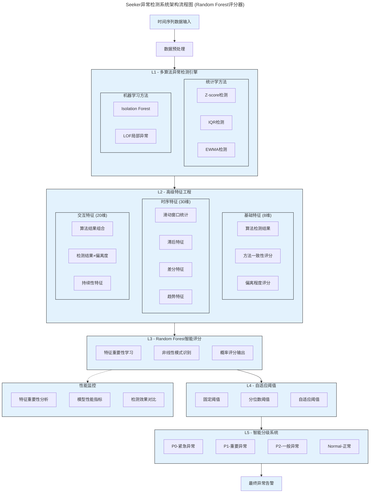

```mermaid
---
title: Seeker异常检测系统架构流程图 (Random Forest评分器)
---
graph TD
    A[时间序列数据输入] --> B[数据预处理]
    B --> DetectionBox
    
    subgraph DetectionBox["L1 - 多算法异常检测引擎"]
        direction TB
        subgraph StatMethods["统计学方法"]
            F1[Z-score检测]
            F2[IQR检测]
            F3[EWMA检测]
        end
        
        subgraph MLMethods["机器学习方法"]
            G1[Isolation Forest]
            G2[LOF局部异常]
        end
    end
    
    DetectionBox --> FeatureEng[特征工程]
    
    subgraph FeatureEng["L2 - 高级特征工程"]
        direction TB
        subgraph BasicFeatures["基础特征 (8维)"]
            H1[算法检测结果]
            H2[方法一致性评分]
            H3[偏离程度评分]
        end
        
        subgraph TimeFeatures["时序特征 (30维)"]
            I1[滑动窗口统计]
            I2[滞后特征]
            I3[差分特征]
            I4[趋势特征]
        end
        
        subgraph InteractionFeatures["交互特征 (20维)"]
            J1[算法结果组合]
            J2[检测结果×偏离度]
            J3[持续性特征]
        end
    end
    
    FeatureEng --> RFScorer[Random Forest评分器]
    
    subgraph RFScorer["L3 - Random Forest智能评分"]
        direction TB
        K1[特征重要性学习]
        K2[非线性模式识别]
        K3[概率评分输出]
    end
    
    RFScorer --> ThresholdSystem[智能阈值系统]
    
    subgraph ThresholdSystem["L4 - 自适应阈值"]
        direction TB
        L1[固定阈值]
        L2[分位数阈值]
        L3[自适应阈值]
    end
    
    ThresholdSystem --> Classification[异常分类]
    
    subgraph Classification["L5 - 智能分级系统"]
        direction TB
        M1[P0-紧急异常]
        M2[P1-重要异常]
        M3[P2-一般异常]
        M4[Normal-正常]
    end
    
    Classification --> N[最终异常告警]
    
    subgraph PerformanceMonitor["性能监控"]
        direction TB
        O1[特征重要性分析]
        O2[模型性能指标]
        O3[检测效果对比]
    end
    
    RFScorer -.-> PerformanceMonitor
    
    style A fill:#e3f2fd
    style N fill:#e3f2fd
    style DetectionBox fill:#e3f2fd,stroke:#000000,stroke-width:1px
    style StatMethods fill:#e3f2fd,stroke:#000000,stroke-width:1px
    style MLMethods fill:#e3f2fd,stroke:#000000,stroke-width:1px
    style FeatureEng fill:#e3f2fd,stroke:#000000,stroke-width:1px
    style BasicFeatures fill:#e3f2fd,stroke:#000000,stroke-width:1px
    style TimeFeatures fill:#e3f2fd,stroke:#000000,stroke-width:1px
    style InteractionFeatures fill:#e3f2fd,stroke:#000000,stroke-width:1px
    style RFScorer fill:#e3f2fd,stroke:#000000,stroke-width:1px
    style ThresholdSystem fill:#e3f2fd,stroke:#000000,stroke-width:1px
    style Classification fill:#e3f2fd,stroke:#000000,stroke-width:1px
    style PerformanceMonitor fill:#e3f2fd,stroke:#000000,stroke-width:1px
```
