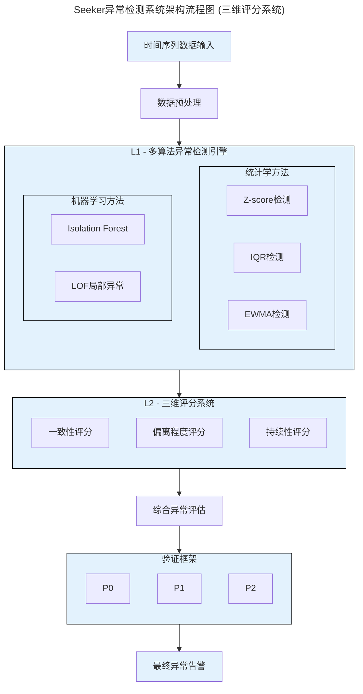

```mermaid
---
title: Seeker异常检测系统架构流程图 (三维评分系统)
---
graph TD
    A[时间序列数据输入] --> B[数据预处理]
    B --> DetectionBox
    
    subgraph DetectionBox["L1 - 多算法异常检测引擎"]
        direction TB
        subgraph StatMethods["统计学方法"]
            F1[Z-score检测]
            F2[IQR检测]
            F3[EWMA检测]
        end
        
        subgraph MLMethods["机器学习方法"]
            G1[Isolation Forest]
            G2[LOF局部异常]
        end
    end
    
    DetectionBox --> THREEDIMENSION[三维评分系统]
    
    subgraph THREEDIMENSION["L2 - 三维评分系统"]
        direction TB
        I[一致性评分]
        J[偏离程度评分]
        K[持续性评分]
    end

    

    THREEDIMENSION --> L[综合异常评估]
    L --> SEVERITY[验证框架]
    subgraph SEVERITY["验证框架"]
        direction TB
        P0[P0]
        P1[P1]
        P2[P2]
    end
    SEVERITY --> O[最终异常告警]

    
    
    style A fill:#e3f2fd
    style O fill:#e3f2fd
    style DetectionBox fill:#e3f2fd,stroke:#000000,stroke-width:1px
    style StatMethods fill:#e3f2fd,stroke:#000000,stroke-width:1px
    style MLMethods fill:#e3f2fd,stroke:#000000,stroke-width:1px
    style THREEDIMENSION fill:#e3f2fd,stroke:#000000,stroke-width:1px
    style SEVERITY fill:#e3f2fd,stroke:#000000,stroke-width:1px
```
