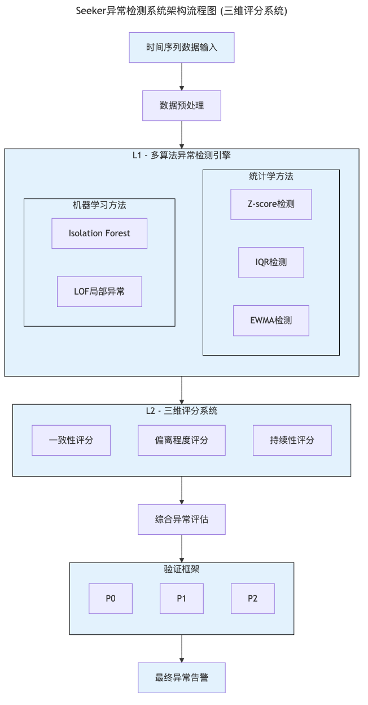

# Seeker - 时间序列异常检测

---

# 静态阈值有什么痛点?

---

# 误报疲劳

某团队: “上周四凌晨3点，系统触发127条磁盘使用率告警，运维团队紧急排查——结果全是正常业务高峰。每月68%的告警是误报，消耗团队400+工时。”

*静态阈值正在透支团队信任，而我们可以用机器学习终结这一切。*

---

# 静态阈值为什么失灵?

---
## 静态监控的三大致命伤
| 缺陷       | 后果                          |
| ---------- | ----------------------------- |
| 刻舟求剑   | 无法适应周期/趋势(如大促流量) |
| 见树不见林 | 忽略指标关联(如CPU,错误率)    |
| 疲于调参   | 人工维护成本                  |

---
## 业务损失量化
- **误报**成本：平均响应耗时 × 虚假告警次数 × 团队时薪
*（例：1h/次 × 50次/月 × $100/h = $5,000/月）*

- **漏报**风险：故障恢复时间延长导致的收入损失（案例：某次漏报导致服务降级2小时，损失$25k）

---

# 机器学习如何破局?

---
## 核心优势对比
| 能力           | 静态阈值     | 机器学习               |
| -------------- | ------------ | ---------------------- |
| 动态适应性     | ❌固定        | ✅                      |
| 多指标关联分析 | ❌孤立检测    | ✅                      |
| 未知模式发现   | ❌仅规则预设  | ✅                      |
| 维护成本       | 高频人工干预 | 模型迭代以减少人工干预 |

---
## 技术方案亮点

---

### 系统架构流程图

---

### 核心组件

1. **异常检测引擎**
    - 5种检测算法：Z-score、IQR、EWMA、Isolation Forest、LOF
    - 统计方法和机器学习方法的结合
2. **验证框架**
    - 多方法集成验证 (Ensemble method)
    - 综合评分机制

---
## 效果验证
测试对比数据：用历史数据检测，展示同一时段效果...

---
# 实施路径
---
## 技术演进要点
- 优化增强ensemble策略
- 自适应参数
- 有监督+无监督双轨检测
- 多模态异常检测
- 可解释性增强

---
## 三步走落地策略
试点: 单业务线核心指标验证
推广: 覆盖TOP 10关键指标
全量: 替换80%静态阈值

---
## 资源与ROI估算
- 成本：开发工时（人月） + 训练资源（$X/月）

- 收益（年）：
    误报减少节省工时：(原误报次数 × 平均处理时间) - (新误报次数 × 处理时间) × 时薪 × 12
    故障止损：漏报减少次数 × 平均故障损失
    预计年节省 $150,000，投入回报比 1:3.5

---
# 总结
机器学习不是增加复杂度，而是用自动化对抗系统复杂性。
